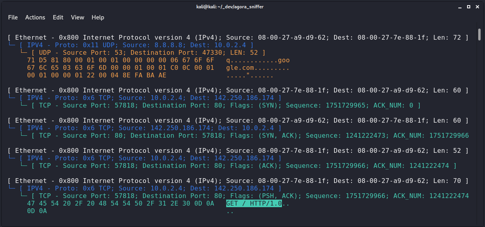

# Agora Network Sniffer

This is a rudimentary Python3 Network Sniffer (Ethernet II, IPv4, TCP, UDP).



This code was created for a tutorial on my blog [Tutorial: Build a Network Sniffer From Scratch](https://secoats.github.io/tutorial/ethernet_sniffer/).  

You can find the original code from that blog post in the git branch ["tutorial"](https://github.com/secoats/agora_sniffer/tree/tutorial)".  
I might add some more features over time on the "main" branch.

It requires L2 raw socket access (ETH_P_ALL), so **it will only work on unix-like systems** at the moment and requires **root priviliges**. I might add support for Windows at some point.

Only run this and similar code in a network you personally own and control. Using a VM network might be a good idea. This code is still work-in-progress.


## Usage

```bash
sudo python3 ./sniffer.py
```

There are no library requirements.